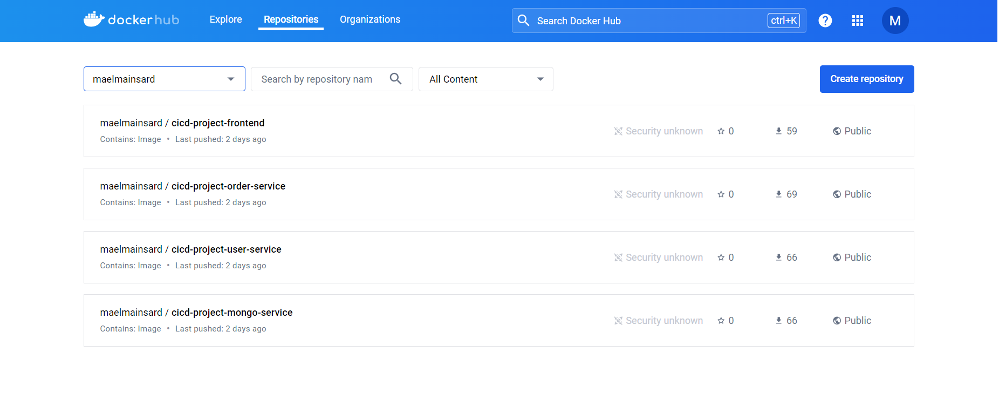
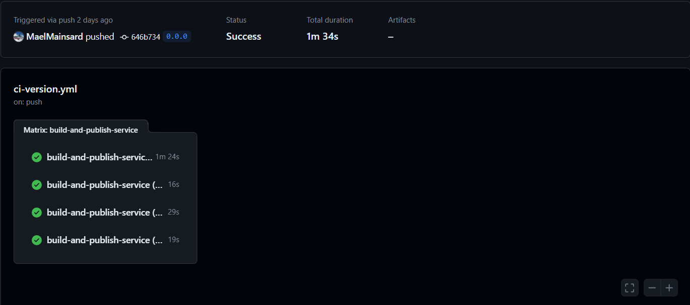
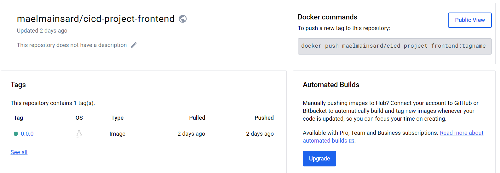
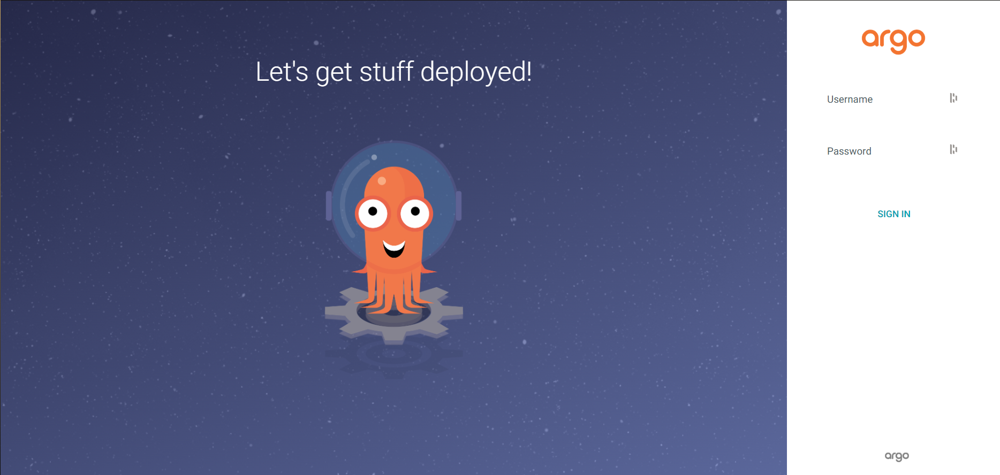
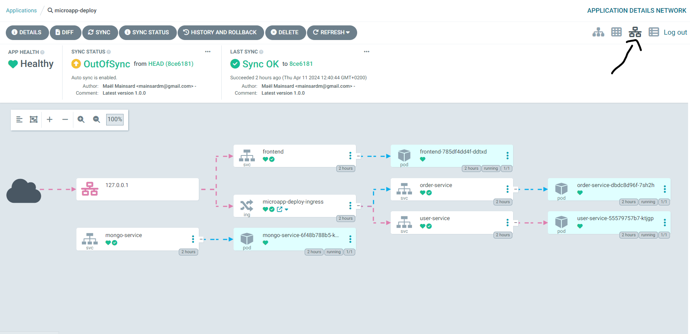

# Projet : Mise en place du CICD dans un environnement Kubernetes pour une application de microservices

## Contexte

Vous travaillez sur le déploiement d'une application composée de microservices dans un environnement Kubernetes. L'application est constituée de quatre services : le frontend React, le service de gestion des commandes (order-service), le service utilisateur interagissant avec une base de données MongoDB, et enfin, une instance MongoDB.

## Étapes du Projet :

**1. Configuration, Dockerisation et test en Local :**

Clonez le repository sur votre machine :
```bash
git clone https://github.com/mpakoupete/cicd-project.git
```
Afin que les services puissent communiquer entre eux par la suite nous allons devoir faire quelques modifications.

Dans  **front-end-react/src/App.js** remplacez :
```js
'http://localhost:3001/user' => 'http://user-service:3001/user'
```
```js
'http://localhost:3002/order' => 'http://order-service:3002/order'
```
Dans **user-service/app.py** remplacez :
```py
'mongodb://localhost:27017/' => 'mongodb://mongo-service:27017/'
```
Maintenant, nous allons tester en local si notre stack fonctionne normalement. Pour cela créez 4 fichiers **Dockerfile** aux emplacements ci-dessous : 

*Emplacement : front-end-react*
```docker
FROM node:13.12.0-alpine as build
WORKDIR /app
ENV PATH /app/node_modules/.bin:$PATH
COPY package.json ./
COPY package-lock.json ./
RUN npm ci --silent
RUN npm install react-scripts@3.4.1 -g --silent
COPY . ./
RUN npm run build

# production environment
FROM nginx:stable-alpine
COPY --from=build /app/build /usr/share/nginx/html/frontend
# new
COPY nginx/nginx.conf /etc/nginx/conf.d/default.conf
EXPOSE 80
CMD ["nginx", "-g", "daemon off;"]
```
*Emplacement : order-service*
```docker
FROM node:18
WORKDIR /usr/src/app
COPY package*.json ./
RUN npm install
COPY . .
CMD ["node", "server.js"]
EXPOSE 3002
```
*Emplacement : user-service*
```docker
FROM python:3.8-slim-buster
WORKDIR /usr/src/app
COPY requirements.txt requirements.txt
RUN pip3 install -r requirements.txt
COPY . .
EXPOSE 3001
CMD [ "python3", "app.py" ]
```
*Emplacement : / (A la racine)*
```docker
FROM mongo
EXPOSE 27017
```
Maintenant que les Dockerfiles sont créés, nous allons créer un fichier docker-compose pour tester rapidement l'application en local. 

A la racine du projet, créez un nouveau fichier **docker-compose.yaml**
```docker
version: '3.8'

services:
  mongo-service:
    container_name: mongo-service
    image: mongo
    ports:
      - "27017:27017"
    volumes:
      - dbdata:/data/db
    networks:
      - cicd-net

  frontend:
    container_name: frontend
    build:
      context: ./front-end-react
      dockerfile: Dockerfile
    ports:
      - 3000:80
    networks:
      - cicd-net
    depends_on:
      - user-service
      - order-service

  user-service:
    container_name: user-service
    build:
      context: ./user-service
      dockerfile: Dockerfile
    networks:
      - cicd-net
    ports:
      - 3001:3001
    depends_on:
      - mongo-service

  order-service:
    container_name: order-service
    build:
      context: ./order-service
      dockerfile: Dockerfile
    networks:
      - cicd-net
    ports:
      - 3002:3002

networks:
  cicd-net:
    driver: bridge

volumes:
  dbdata:
```
Maintenant, ouvrez un terminal et exécutez cette commande : 
```bash
docker compose up -d
```
Maintenant rendez-vous via un navigateur au http://localhost:3000. Vous devriez voir ça : 


Testez si les services communiquent bien entre eux en cliquant sur GetOrders ou en renseignant un nom et prénom.

**2. Modification du FrontEnd pour le deployement**

Avant de déployer sur k8s, il faut que l'on change quelques lignes du frontend :

Dans  **front-end-react/src/App.js** remplacez :
```js
'http://user-service:3001/user' => 'http://api.microapp-deploy.com/user/user'
```
```js
'http://order-service:3002/order' => 'http://api.microapp-deploy.com/order/order'
```

Vous comprendrez par la suite pourquoi.

**3. Création des repository docker hub:**

Les images docker qui vont être générées par la suite doivent être poussées vers des repository dockerhub afin d'être récupérées par k8s & argocd par la suite. Pour cela créez un repository pour chaque services :
* cicd-project-frontend
* cicd-project-order-service
* cicd-project-user-service
* cicd-project-mongo-service

Vous devriez avoir quelque chose de similaire à ceci :



**4. Mise en place du pipeline CI :**

À la racine du projet créez un nouveau dossier **.github** puis, dans ce dossier , créez un nouveau dossier **workflows**. Rendez-vous dans ce dossier et créez un nouveau fichier **ci-pipeline.yml** puis, copier/coller ce code :
```yml
name: CI pour versionning

on:
  push:
    branches:
      - '*.*.*'
      - 'prod'

jobs:
  build-and-publish-service:
    runs-on: ubuntu-latest
    strategy:
      matrix:
        service:
          - name: frontend
            context: ./front-end-react

          - name: order-service
            context: ./order-service
          
          - name: user-service
            context: ./user-service
           
          - name: mongo-service
            context: ./
            

    steps:
      - name: Checkout du repository
        uses: actions/checkout@v4

      - name: Log in to Docker Hub
        uses: docker/login-action@f4ef78c080cd8ba55a85445d5b36e214a81df20a
        with:
          username: ${{ secrets.DOCKER_USERNAME }}
          password: ${{ secrets.DOCKER_PASSWORD }}

      - name: Extract metadata (tags, labels) for Docker
        id: meta
        uses: docker/metadata-action@9ec57ed1fcdbf14dcef7dfbe97b2010124a938b7
        with:
          images: maelmainsard/cicd-project-${{ matrix.service.name }}

      - name: Build and push Docker image
        uses: docker/build-push-action@3b5e8027fcad23fda98b2e3ac259d8d67585f671
        with:
          context: ${{ matrix.service.context }}
          file: ${{ matrix.service.context }}/Dockerfile
          push: true
          tags: ${{ steps.meta.outputs.tags }}
          labels: ${{ steps.meta.outputs.labels }}
```
> Pour info ce code s'exécutera lorsqu'on réalisera un push sur la branche prod et lorsque qu'une branche de version sera crée ( Ex : 0.0.2 )

Une fois un push réalisé sur prod ou lors de la création d'une nouvelle branche de versionning, rendez-vous dans github action et veillez à ce que vos jobs ne soient pas en erreur : 



Une fois cela fait, nous allons vérifier que les images ont bien été push dans les repository privés. Pour cela connectez vous à votre compte dockerhub et allez dans chaque repository pour vérifier que l'image en question a bien été publiée : 



> On voit ci-dessus que l'image 0.0.0 à bien été téléversée vers le repo.

**5. Création du repo de deployement :**

Sur votre compte github créez un nouveau repository github **microapp-deploy**.

Réalisez un git clone de votre repository dans votre ide préféré et créez à la racine du projet un fichier **app.yaml** puis, copier/coller ce code :

```yml
apiVersion: argoproj.io/v1alpha1
kind: Application
metadata:
  name: microapp-deploy
  namespace: argocd
spec:
  destination:
    namespace: microapp-deploy
    server: https://kubernetes.default.svc 
  project: default 
  source: 
    path: deploy
    repoURL: https://github.com/MaelMainsard/microapp-deploy
    targetRevision: HEAD
  syncPolicy: 
    automated: {}
    syncOptions:
    - CreateNamespace=true
```
Créez ensuite un dossier **deploy** à la racine du projet et créez tous ces fichiers :

> Note : Dans les fichiers de types déploiements, n'oubliez pas de changer la version des images docker par la version que vous souhaitez.

*frontend-deployment.yaml*
```yml
apiVersion: apps/v1
kind: Deployment
metadata:
  labels:
    app: frontend
  name: frontend
  namespace: microapp-deploy
spec:
  replicas: 1
  selector:
    matchLabels:
      app: frontend
  strategy: {}
  template:
    metadata:
      labels:
        app: frontend
    spec:
      containers:
      - image: maelmainsard/cicd-project-frontend:1.0.0
        name: frontend
        ports:
          - containerPort: 3000
      resources: {}
```

*frontend-svc.yaml*

```yml
apiVersion: v1
kind: Service
metadata:
  labels:
    app: frontend
  name: frontend
  namespace: microapp-deploy
spec:
  type: LoadBalancer
  ports:
  - port: 3000
    protocol: TCP
    targetPort: 80
  selector:
    app: frontend
```
*mongo-service-deployment.yaml*

```yml
apiVersion: apps/v1
kind: Deployment
metadata:
  labels:
    app: mongo-service
  name: mongo-service
  namespace: microapp-deploy
spec:
  replicas: 1
  selector:
    matchLabels:
      app: mongo-service
  strategy: {}
  template:
    metadata:
      labels:
        app: mongo-service
    spec:
      containers:
      - image: maelmainsard/cicd-project-mongo-service:1.0.0
        name: mongo-service
        ports:
          - containerPort: 27017
      resources: {}
```

*mongo-service-svc.yaml*

```yml
apiVersion: v1
kind: Service
metadata:
  labels:
    app: mongo-service
  name: mongo-service
  namespace: microapp-deploy
spec:
  type: ClusterIP
  ports:
  - port: 27017
    protocol: TCP
    targetPort: 27017
  selector:
    app: mongo-service
```

*order-service-deployment.yaml*

```yml
apiVersion: apps/v1
kind: Deployment
metadata:
  labels:
    app: order-service
  name: order-service
  namespace: microapp-deploy
spec:
  replicas: 1
  selector:
    matchLabels:
      app: order-service
  strategy: {}
  template:
    metadata:
      labels:
        app: order-service
    spec:
      containers:
      - image: maelmainsard/cicd-project-order-service:1.0.0
        name: order-service
        ports:
          - containerPort: 3002
      resources: {}
```

*order-service-svc.yaml*

```yml
apiVersion: v1
kind: Service
metadata:
  labels:
    app: order-service
  name: order-service
  namespace: microapp-deploy
spec:
  type: ClusterIP
  ports:
  - port: 3002
    protocol: TCP
    targetPort: 3002
  selector:
    app: order-service
```

*user-service-deployment.yaml*

```yml
apiVersion: apps/v1
kind: Deployment
metadata:
  labels:
    app: user-service
  name: user-service
  namespace: microapp-deploy
spec:
  replicas: 1
  selector:
    matchLabels:
      app: user-service
  strategy: {}
  template:
    metadata:
      labels:
        app: user-service
    spec:
      containers:
      - image: maelmainsard/cicd-project-user-service:1.0.0
        name: user-service
        ports:
          - containerPort: 3001
      resources: {}
```

*user-service-svc.yaml*

```yml
apiVersion: v1
kind: Service
metadata:
  labels:
    app: user-service
  name: user-service
  namespace: microapp-deploy
spec:
  type: ClusterIP
  ports:
  - port: 3001
    protocol: TCP
    targetPort: 3001
  selector:
    app: user-service
```

Notre frontend exécutera les fetchs api depuis un navigateur, pour communiquer avec les différents services , nous avons aussi besoin d'ajouter un ingress :

*ingress-service.yaml*

```yml
apiVersion: networking.k8s.io/v1
kind: Ingress
metadata:
  name: microapp-deploy-ingress
  namespace: microapp-deploy
  annotations:
    nginx.ingress.kubernetes.io/rewrite-target: /$2
spec:
  ingressClassName: nginx
  rules:
  - host: api.microapp-deploy.com
    http:
      paths:
      - path: /order(/|$)(.*)
        pathType: ImplementationSpecific
        backend:
          service:
            name: order-service
            port:
              number: 3002
      - path: /user(/|$)(.*)
        pathType: ImplementationSpecific
        backend:
          service:
            name: user-service
            port:
              number: 3001
```
**6. Modfier votre fichier etc/hosts**

Ajoutez cette ligne à votre fichier : 

127.0.0.1 api.microapp-deploy.com

**7. Deployment sur argocd :**

A la racine du projet, ouvrez un terminal et exécutez cette commande :

```bash
minikube start
```
puis
```bash
kubectl create namespace argocd
```
puis 
```bash
kubectl apply -n argocd -f https://raw.githubusercontent.com/argoproj/argo-cd/stable/manifests/install.yaml
```
puis
```bash
kubectl get pod -n argocd -w
```
Maintenant nous allons ajouter le contrôleur ingress-nginx pour notre ingress. Pour cela exécutez la commande :
```bash
kubectl apply -f https://raw.githubusercontent.com/kubernetes/ingress-nginx/controller-v1.10.0/deploy/static/provider/cloud/deploy.yaml
```
Maintenant, nous avons le namespace argocd, le namespace ingress-nginx. Nous allons pouvoir créer le namespace pour notre app. Exécutez cette commande : 
```bash
kubectl apply -f app.yaml
```
puis
```bash
kubectl get secret argocd-initial-admin-secret -n argocd -o yaml
```
Récupérez le champ base64 password décodez-le et mettez-le de coté pour l'instant. Ensuite exécutez cette commande :
```bash
kubectl port-forward -n argocd svc/argocd-server 8080:443
```
Ouvrez un deuxième terminal et exécutez cette commande : 
```bash
minikube tunnel
```

**6. Vérification du bon fonctionnement**

Rendez vous à **http://localhost:8080**


Dans **username** rentrez "Admin" et dans password le mot de passe précédemment décodé. Puis cliquez sur sign-in.

Rendez vous à l'intérieur du stack et cliquez en sur l'icone en haut à droite :



Vérifiez que tout les pods et services sont opérationnels.

Maintenant rendez-vous au http://localhost:3000 :


Et voila ! Vous avez deployé la stack sur argocd & k8s.
